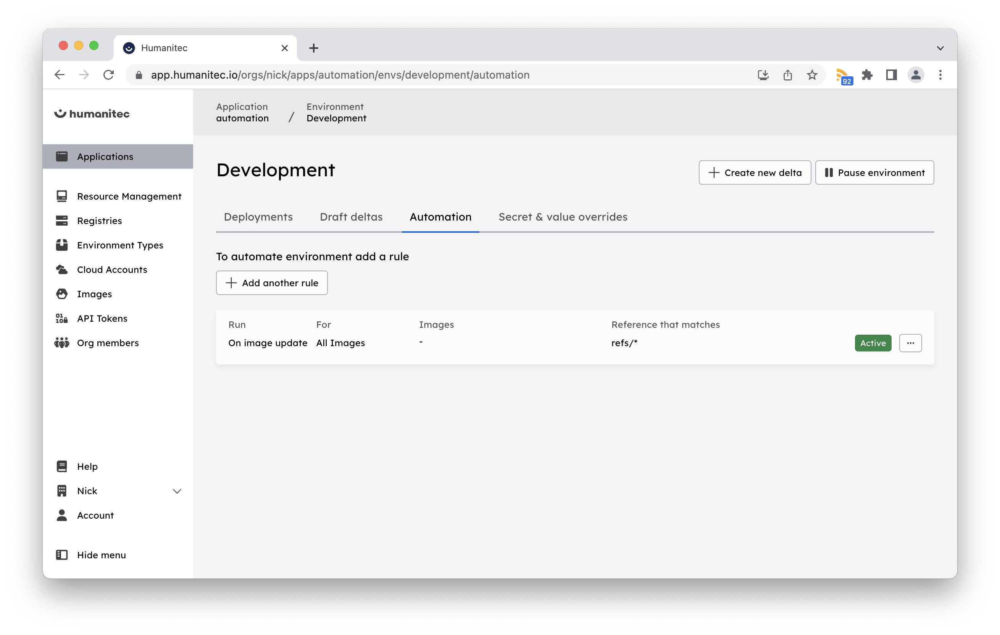
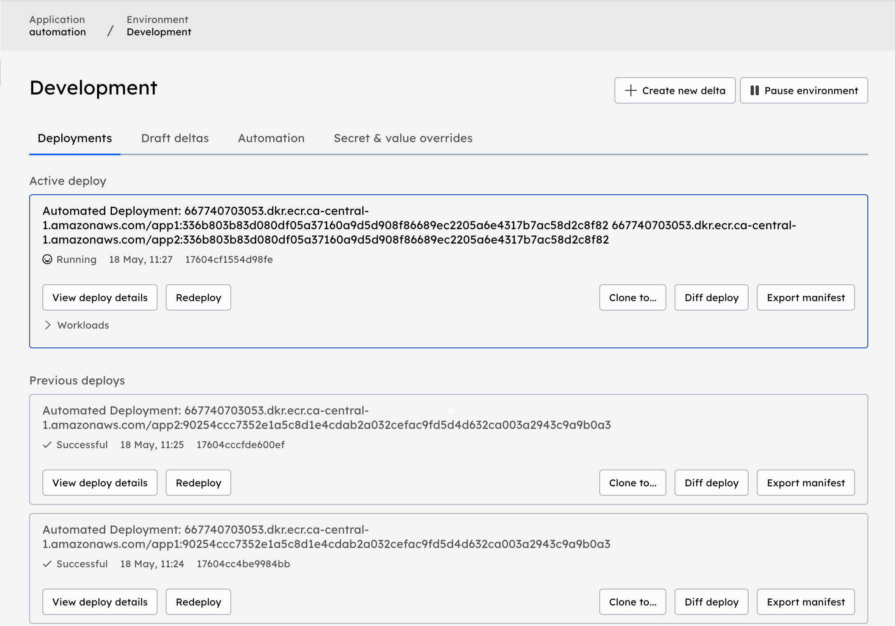

# automation-howto

The following howto will show you how to swap images on your workloads with an automated fashion.
Image Automation is the recommended approach to allow multiple teams working along the same application, each updating one workload. This process avoids running score files and speeding up the deployment.

## General Idea
- One application with multiple workloads
- Two container registries
- One webhook target

## Humanitec Workflow


## Steps
- Create 2 Amazon ECR Repositories Humanitec does not provide guidance on how to configure your AWS services.
- Push two default images
```
docker pull --platform=linux/amd64 httpd:latest 

docker tag httpd:latest 667740703053.dkr.ecr.ca-central-1.amazonaws.com/app1:90254ccc7352e1a5c8d1e4cdab2a032cefac9fd5d4d632ca003a2943c9a9b0a3
docker tag httpd:latest 667740703053.dkr.ecr.ca-central-1.amazonaws.com/app2:90254ccc7352e1a5c8d1e4cdab2a032cefac9fd5d4d632ca003a2943c9a9b0a3

docker push 667740703053.dkr.ecr.ca-central-1.amazonaws.com/app1:90254ccc7352e1a5c8d1e4cdab2a032cefac9fd5d4d632ca003a2943c9a9b0a3
docker push 667740703053.dkr.ecr.ca-central-1.amazonaws.com/app2:90254ccc7352e1a5c8d1e4cdab2a032cefac9fd5d4d632ca003a2943c9a9b0a3
```
- Push the images metadata to Humanitec Artefacts Repository, you can use [Terraform](https://registry.terraform.io/providers/humanitec/humanitec/latest/docs/resources/artefact_version) or the following API call.
```
export HUMANITEC_TOKEN="mytoken"
export HUMANITEC_ORG="myorg"

curl \
--request POST "https://api.humanitec.io/orgs/${HUMANITEC_ORG}/artefact-versions" \
--header "Authorization: Bearer ${HUMANITEC_TOKEN}" \
--header "Content-Type: application/json" \
--data-raw '{ 
    "name": "667740703053.dkr.ecr.ca-central-1.amazonaws.com/app1",
    "type": "container",
    "commit": "90254ccc7352e1a5c8d1e4cdab2a032cefac9fd5d4d632ca003a2943c9a9b0a3",
    "version": "90254ccc7352e1a5c8d1e4cdab2a032cefac9fd5d4d632ca003a2943c9a9b0a3",
    "ref":"refs/heads/main"
}'

curl \
--request POST "https://api.humanitec.io/orgs/${HUMANITEC_ORG}/artefact-versions" \
--header "Authorization: Bearer ${HUMANITEC_TOKEN}" \
--header "Content-Type: application/json" \
--data-raw '{ 
    "name": "667740703053.dkr.ecr.ca-central-1.amazonaws.com/app2",
    "type": "container",
    "commit": "90254ccc7352e1a5c8d1e4cdab2a032cefac9fd5d4d632ca003a2943c9a9b0a3",
    "version": "90254ccc7352e1a5c8d1e4cdab2a032cefac9fd5d4d632ca003a2943c9a9b0a3",
    "ref":"refs/heads/main"
}'
```
- Create a Webhook endpoint, as an example, an AWS Lambda non-vpc function is used. This function will receive payloads from The Orchestrator, and you can use these and process them later, for example creating integrations with Slack or Jira. You will need to provide the customization code, send the payload to a queue and process it accordingly.

    - Create a Lambda function with a Python Runtime, use the following source code:
        ```
        import json
        def lambda_handler(event, context):
            print(event)
            return {
                'statusCode': 204,
                'body': ""
            }
        ```
    - Configure your Lambda function with a [Function URL](https://docs.aws.amazon.com/lambda/latest/dg/lambda-urls.html)
    - Configure the IAM Role for your function, make sure your role includes the `arn:aws:iam::aws:policy/service-role/AWSLambdaBasicExecutionRole` policy.
    - Example of payload
        ```
        {
        "app_id":"automation",
        "comment":"Automated Deployment: 667740703053.dkr.ecr.ca-central-1.amazonaws.com/app1:336b803b83d080df05a37160a9d5d908f86689ec2205a6e4317b7ac58d2c8f82 667740703053.dkr.ecr.ca-central-1.amazonaws.com/app2:336b803b83d080df05a37160a9d5d908f86689ec2205a6e4317b7ac58d2c8f82",
        "delta_id":"dab6fa3b12851fc1a95b2122cf4725868159d0bc",
        "deploy_id":"17604cf1554d98fe",
        "env_id":"development",
        "event":"deployment.finished",
        "org_id":"nick",
        "set_id":"clV3f-fLTXx9svjb4h5cgNgIHlBS5pc9YuP6u_Zds7Q",
        "status":"succeeded",
        "triggered_at":"2023-05-18T17:28:09.094390293Z",
        "triggered_by":"UNKNOWN"
        }
        ```
    - The payloads will be available in your CloudWatch Logs
- Create one application, with 2 workloads `app1` and `app2` [Application and workloads](images/workloads.png)
- Configure the [webhook](images/webhook.png) under the *application* settings, for the event/trigger select "Finished", use the AWS Lambda function URL and the following payload:
    ```
    {
    "event": "${event}",  
    "org_id": "${org_id}",  
    "app_id": "${app_id}",  
    "env_id": "${env_id}",  
    "triggered_at": "${triggered_at}",  
    "triggered_by": "${triggered_by}",  
    "deploy_id": "${deploy_id}",
    "delta_id": "${delta_id}",  
    "set_id": "${set_id}",  
    "comment": "${comment}",
    "status": "${status}"
    }
    ```
- Configure each workload with the default image configured on step 1) and deploy (you can and should use Score for this)
- Configure the Automation under the *environment* settings. The Orchestrator will match the proper values from the `Artefacts Versions`, for instance, for each environment you can configure specific branches.

- Push new images to your ECR repositories (for this example, we will replace the initial Apache `httpd` image for `nginx`)
    ```
    docker pull --platform=linux/amd64 nginxdemos/nginx-hello:latest

    docker tag nginxdemos/nginx-hello:latest 667740703053.dkr.ecr.ca-central-1.amazonaws.com/app1:336b803b83d080df05a37160a9d5d908f86689ec2205a6e4317b7ac58d2c8f82
    docker tag nginxdemos/nginx-hello:latest 667740703053.dkr.ecr.ca-central-1.amazonaws.com/app2:336b803b83d080df05a37160a9d5d908f86689ec2205a6e4317b7ac58d2c8f82

    docker push 667740703053.dkr.ecr.ca-central-1.amazonaws.com/app1:336b803b83d080df05a37160a9d5d908f86689ec2205a6e4317b7ac58d2c8f82
    docker push 667740703053.dkr.ecr.ca-central-1.amazonaws.com/app2:336b803b83d080df05a37160a9d5d908f86689ec2205a6e4317b7ac58d2c8f82
    ```
```
- Push the images metadata to Humanitec Artefacts Repository, you can use [Terraform](https://registry.terraform.io/providers/humanitec/humanitec/latest/docs/resources/artefact_version) or the following API call.
    ```
    export HUMANITEC_TOKEN="mytoken"
    export HUMANITEC_ORG="myorg"
    curl \
    --request POST "https://api.humanitec.io/orgs/${HUMANITEC_ORG}/artefact-versions" \
    --header "Authorization: Bearer ${HUMANITEC_TOKEN}" \
    --header "Content-Type: application/json" \
    --data-raw '{ 
        "name": "667740703053.dkr.ecr.ca-central-1.amazonaws.com/app1",
        "type": "container",
        "commit": "336b803b83d080df05a37160a9d5d908f86689ec2205a6e4317b7ac58d2c8f82",
        "version": "336b803b83d080df05a37160a9d5d908f86689ec2205a6e4317b7ac58d2c8f82",
        "ref":"refs/heads/main"
    }'

    curl \
    --request POST "https://api.humanitec.io/orgs/${HUMANITEC_ORG}/artefact-versions" \
    --header "Authorization: Bearer ${HUMANITEC_TOKEN}" \
    --header "Content-Type: application/json" \
    --data-raw '{ 
        "name": "667740703053.dkr.ecr.ca-central-1.amazonaws.com/app2",
        "type": "container",
        "commit": "336b803b83d080df05a37160a9d5d908f86689ec2205a6e4317b7ac58d2c8f82",
        "version": "336b803b83d080df05a37160a9d5d908f86689ec2205a6e4317b7ac58d2c8f82",
        "ref":"refs/heads/main"
    }'
    ```
- Humanitec will deploy automatically the images, and hit the webhook configured
    

### Next steps
- Configure your pipelines
    - Build and push your docker images to your registry
    - if the `score` file is not modified between runs, then skip the stage.
        - Call the [Artefact Version API](https://api-docs.humanitec.com/#tag/ArtefactVersion/paths/~1orgs~1%7BorgId%7D~1artefact-versions/post)
        - Monitor the webhook calls, and integrate with your Slack, Jira or another notification service
    - if the `score` file was modified between runs, deploy using `score-humanitec` as usual, with the new container image, along all the extensions required.