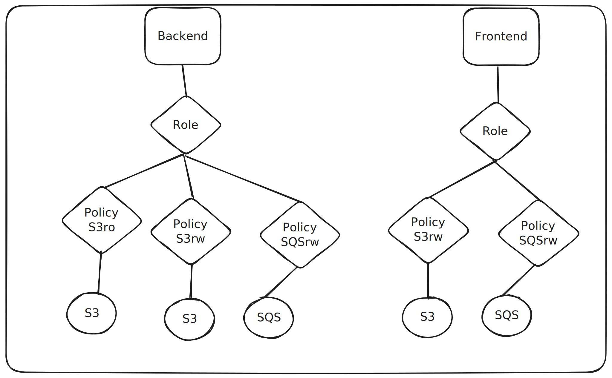

# pod-identities

The following example shows how to configure multiple workloads and their corresponding AWS IAM Roles using EKS Pod Identities. 

If you wish to utilize IAM roles for service accounts (IRSA), this repository might help you, however AWS recommends using the new EKS Pod Identities approach.

For more information the [AWS documentation](https://aws.amazon.com/blogs/aws/amazon-eks-pod-identity-simplifies-iam-permissions-for-applications-on-amazon-eks-clusters/)

Requirements:
* AWS Credentials with support to create IAM Roles and policies
* EKS Cluster
    * Kubernetes 1.24
    * Cluster Access Configuration set to `API` or `API_AND_CONFIG_MAP`
    * eks-pod-identity-agent addon

## Architecture

