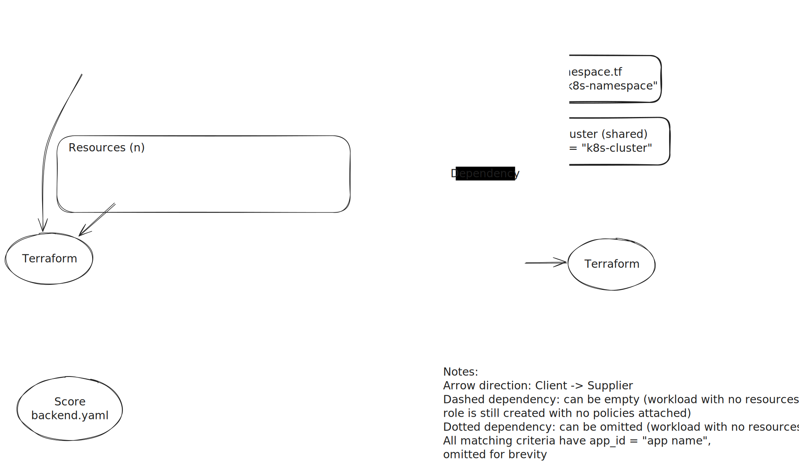

# pod-identities

The following example shows how to configure multiple workloads and their corresponding AWS IAM Roles using EKS Pod Identities. 

If you wish to utilize IAM roles for service accounts (IRSA), this repository might help you, however AWS recommends using the new EKS Pod Identities approach.

For more information about the EKS Pod Identities see the [AWS documentation](https://aws.amazon.com/blogs/aws/amazon-eks-pod-identity-simplifies-iam-permissions-for-applications-on-amazon-eks-clusters/)

Requirements:
* AWS Credentials with support to create IAM Roles and policies. For more information see the [AWS IAM Humanitec Onboarding User](../humanitec-onboarding-aws-iam-user)
* EKS Cluster
    * Kubernetes >=1.24
    * Cluster Access Configuration set to `API` or `API_AND_CONFIG_MAP`
    * `eks-pod-identity-agent` addon

## Target Architecture


## Humanitec IAC
* Humanitec will [require a standard namespace](resource-definition/namespace.tf). This namespace is where all your workloads will be deployed.
* AWS IAM Policies:

    * In this example, we have defined 3 policies:
        * Two for [S3](resource-definition/policy-s3.tf) and [S3ro](resource-definition/policy-s3ro.tf)
        * One for [SQS](resource-definition/policy-sqs.tf) 
        * These policies will be used for all your workloads, providing the same set of permissions agaisnt AWS resources, however, each workload will have access to only the resources that belong to its configuration as defined by the `Target Architecture`. These policies point to an inline Terraform manifest that actually creates the resources in AWS.
    * Each policy is identified by its parent caller resource by its class (note the highligthed line):
        * [s3#L36](resource-definition/policy-s3.tf#L36)
        * [s3ro#L36](resource-definition/policy-s3ro.tf#L36)
        * [sqs#L36](resource-definition/policy-sqs.tf#L36)
        * This would allow to create different policies, such as `s3rw` for read and write operations, or `s3ro` for read-only. This is based on your applications needs. Humanitec does not provide AWS IAM Policy recommendations nor guidance, please contact your AWS Partner or AWS Architect to develop such policies.
* AWS Resources:

    * For the AWS resource that will require a policynote the highligthed line):
        * [S3#L8](resource-definition/s3.tf#L8)
        * [S3ro#L8](resource-definition/s3ro.tf#L8)
        * [SQS#L8](resource-definition/sqs.tf#L8) 
        * Within their resource definition configuration, you will see a [co-provision of resources](https://developer.humanitec.com/platform-orchestrator/resources/resource-graph/#co-provision-resources) `provision` stanza.
            * Example of `provision` stanza.
                ```
                provision = {
                    "aws-policy.s3" = {
                    "is_dependent" : true,
                    "match_dependents" : true
                    }
                }
                ```
            Within this stanza, you can configure which policy will be created automatically. In the case depicted, the Orchestrator will create a policy with a class `s3`. If you had different kind of S3 policies, you would configure such `"aws-policy.s3rw"` or `"aws-policy.s3ro"`. This would also require to create two different classes of S3 resource definitions.
* AWS Resources and their AWS IAM Policies:

    * Each policy will receive a set of ARNs using the [Resource Selector Syntax](https://developer.humanitec.com/platform-orchestrator/resources/resource-graph/#resource-selectors) placeholder

    * Example: 
        * `"$${resources['aws-policy.s3>s3'].outputs.arn}"`: this placeholder can be read as: retrieve all the ARNs of S3 buckets `>s3` that are requesting a policy of class s3 `aws-policy.s3`
    * If you had custom policies, you would need to adjust the class such as:
        * `"$${resources['aws-policy.s3rw>s3'].outputs.arn}"` or `"$${resources['aws-policy.s3ro>s3'].outputs.arn}"`
        * You would then need to [process and adjust them](resource-definition/source/s3-policy.tf#L34) as needed to build your policies.
        * Custom policy example:
            * The parent AWS Resource [`s3ro#L8`](resource-definition/s3ro.tf#L8) 
            * [`policy s3ro#L18`](resource-definition/policy-s3ro.tf#L18)
            * [`policy s3ro#L36`](resource-definition/policy-s3ro.tf#L36)
            * Please note their class names and the way they are constructed, and how both resources are connected using the class `s3ro`.
* Deploying Applications with Score
    * Please note the resources section within [backend.yaml](backend.yaml) and [frontend.yaml](frontend.yaml):
        ```
        resources:
        "s3":
            type: s3
            class: mys3
        "s3ro":
            type: s3
            class: mys3ro
        "sqs":
            type: sqs
            class: mysqs
        ```
* AWS IAM Role and Workload Association:
    * In order to put everything together, it is important to define a a resource definition of type [`aws-role`](resource-definition/role.tf) along with the [workload (backend)](resource-definition/workload-backend.tf), [workload (frontend)](resource-definition/workload-frontend.tf) and the [service account (backend)](resource-definition/service-account-backend.tf), [service account (frontend)](resource-definition/service-account-frontend.tf) for each workload in advance. 
    * The role  resource definition  contains a placeholder which references the AWS IAM Policies for the current context `$${resources.workload>aws-policy.outputs.arn}` which can be read as: For the current workload, find all the policies created, and retrieve their ARNs. This role then will be created in AWS, and an EKS Pod Identity association would be created using its [Terraform definition](resource-definition/source/role.tf#53).
    * Workload configuration:

        * Line 10 will trigger the creation of the custom service account for the workload
            * [workload (backend)#L10](resource-definition/workload-backend.tf#L10)
            * [workload (frontend)#L10](resource-definition/workload-frontend.tf#L10)
        * Line 16 will trigger the creation of the AWS Rrole for the workload.
            * [workload (backend)#L16](resource-definition/workload-backend.tf#L16)
            * [workload (frontend)#L16](resource-definition/workload-frontend.tf#L16)
        * Line 36 overrides using matching criteria the default workload with this custom one.
            * [workload (backend)#L36](resource-definition/workload-backend.tf#L36)
            * [workload (frontend)#L36](resource-definition/workload-frontend.tf#L36)

## Humanitec IAC Relationship
The following diagram explains the relationship between resource definitions and matching criteria. The example below will configure one resource of type S3 with its corresponding policy, then attach it to a workload named `backend`. Matching Criterias are designed to allow the same resource definitions be reused across any environment type and name. In order to customize per environment, `env_id` and `env_type` can be added accordingly to the resoruce definitions.
